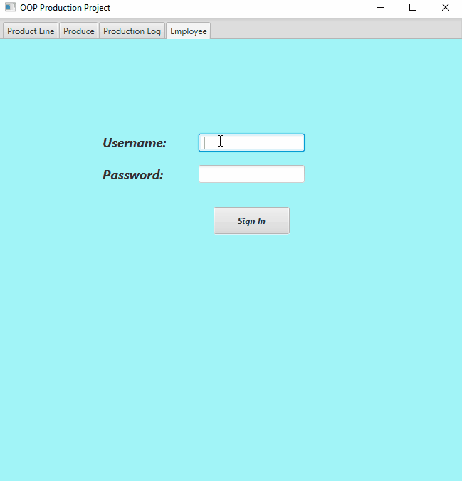

# OOP Production Project

This JavaFX project allows the user to input data in a GUI so that it is saved inside a database. 
I created this project in my Object Oriented class by myself and am releasing it's Beta version. 
I have been working on this project for 5 weeks and this is the Beta version after completing Sprint 2. 
This assignment has challenged me in using a GUI and taking the input to be used in a database. 
I made this as my main project for my COP 3003 class with Professor Vanselow. 

## Demonstration

Gif Coming Soon  
 

 

## Documentation

[JavaDoc](docs/index.html)

## Diagrams

  

 
## Getting Started

Coming Soon  

## Built With

* IDE used Intellij 
* Other software used JavaFX, Gradle, Scenebuilder 
* Resources used  Connected a database to my JavaFX project and was able to obtain user input from Scenebuilder and store it in the database. 

## Contributing

I have been working on this project privately with assistiance of my professor and teach assistance to improve my knowledge. 

## Author

* Dylan Miles 

## License

This project is licensed under the MIT License.

## Acknowledgments

* Web sites utilized: https://sites.google.com/site/profvanselow/course/cop-3003
* Special thanks to Professor Vanselow, Jeremy, and Vlad 

## History

I originally had many iterations of this project on github, yet I named my orignal project incorrectly so I created a new project for the submittion of Sprint 1 (Alpha).

## Key Programming Concepts Utilized

I learned a lot about linking a database to my code to make it functional. I also learned a lot about SceneBuilder and the power that it has to create a GUI that works along side my project. 
I will continue to learn more and grow this project fully. 

