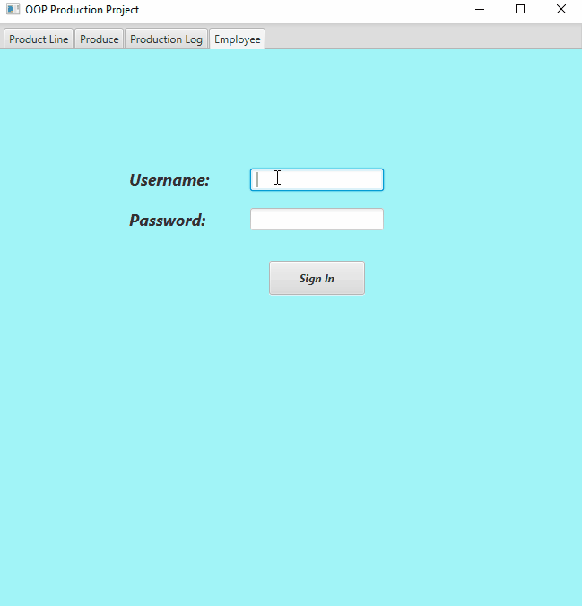
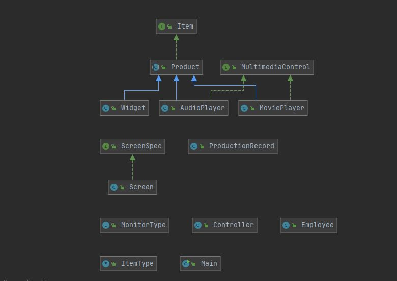
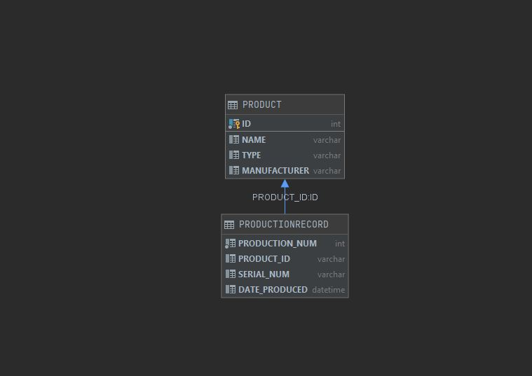

# OOP Production Project

This JavaFX project is a GUI program that allows the user to input data in text fields that are then saved inside the database then produces back to the screen. 
I created this project in my object oriented class independently and am releasing it's Final version. 
I have been working on this project in COP 3003 for the Fall 2020 semester 
This assignment has challenged me in using a GUI and taking the input to be used in a database as well as working with a number of different classes together. 
This is my main production project for my object oriented course that has greatly expanded my knowledge of object oriented programming. 

## Demonstration

  

 

## Documentation

[JavaDoc](https://dmiless.github.io/OOPProductionProject/index.html)

## Diagrams

  

Class Diagram  

Database Diagram  

 
## Getting Started

Download the most recent version of Intellij  
Select 'Get from version control' once Intellij starts  
Copy and paste this project's github URL and clone the project  
This should load the most recent version to edit/run  

## Built With

* IDE used Intellij 
* Other software used JavaFX, Gradle, Scenebuilder 
* Resources used  Connected a database to my JavaFX project and was able to obtain user input from Scenebuilder and store it in the database. 

## Contributing

I have been working on this project privately with assistiance of my professor and teach assistance to improve my knowledge. 

## Author

* Dylan Miles 

## License

This project is licensed under the MIT License.

## Acknowledgments

* Web sites utilized: https://sites.google.com/site/profvanselow/course/cop-3003
* Special thanks to Professor Vanselow, Jeremy, and Vlad 

## History
Sprint 1 (Alpha) - 9/19/20  
Sprint 2 (Beta) - 10/31/20  
Sprint 3 (Release) - 12/2/20  
I originally had many iterations of this project on github, yet I named my orignal project incorrectly so I created a new project for the submittion of Sprint 1 (Alpha).

## Key Programming Concepts Utilized

I learned a lot about linking a database to my code to make it functional. I also learned a lot about SceneBuilder and the power that it has to create a GUI that works along side my project. This also expanded my knowledge on using many different types of classes with one another to produce one larger program. 

